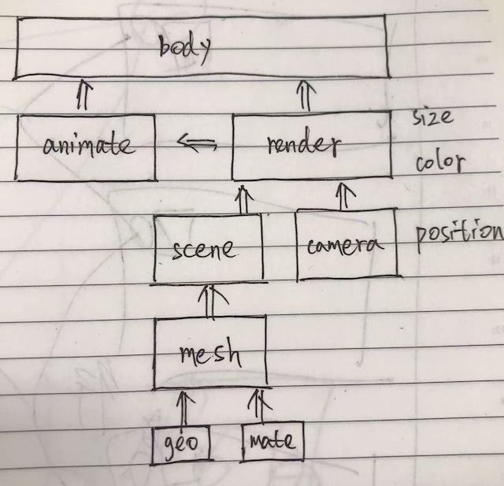
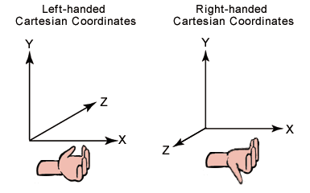
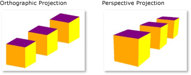

# 基础知识

::: tip 前言
要在屏幕上展示 3D 图形，思路大体上都是这样的：

- 1.构建一个三维空间：Three 中称之为场景(Scene)
- 2.选择一个观察点，并确定观察方向/角度等：Three 中称之为相机(Camera)
- 3.在场景中添加供观察的物体：Three 中的物体有很多种，包括 Mesh,Line,Points 等，它们都继承自 Object3D 类
- 4.将观察到的场景渲染到屏幕上的指定区域：Three 中使用 Renderer 完成这一工作
  :::
  简易的开发流程

<xminder tipkey="b"/>

## 1.Scene

场景是所有物体的容器，也对应着我们创建的三维世界。

## 2.Camera

**坐标系**

Camera 是三维世界中的观察者，为了观察这个世界，首先我们要描述空间中的位置。 Three 中使用采用常见的右手坐标系定位。

**三维投影**

Three 中的相机有两种，分别是正投影相机 `THREE.OrthographicCamera` 和透视投影相机 `THREE.PerspectiveCamera`。

正交投影与透视投影的区别如上图所示，左图是正交投影，物体发出的光平行地投射到屏幕上，远近的方块都是一样大的；右图是透视投影，近大远小，符合我们平时看东西的感觉。

- 正交投影相机

这里补充一个视景体的概念：视景体是一个几何体，只有视景体内的物体才会被我们看到，视景体之外的物体将被裁剪掉。这是为了去除不必要的运算。

- 透视投影相机

透视投影相机很符合我们通常的看东西的感觉，因此大多数情况下我们都是用透视投影相机展示 3D 效果。

## 3.Mesh

Three 中供显示的物体有很多，它们都继承自 Object3D 类，这里我们主要看一下 Mesh 和 Points 两种。

我们都知道，计算机的世界里，一条弧线是由有限个点构成的有限条线段连接得到的。线段很多时，看起来就是一条平滑的弧线了。

计算机中的三维模型也是类似的，普遍的做法是用三角形组成的网格来描述，我们把这种模型称之为 Mesh 模型。

在 Three 中，Mesh 的构造函数是这样的：

Mesh( geometry, material )

geometry 是它的形状，material 是它的材质。

## 4.Geometry

Geometry，形状，相当直观。Geometry 通过存储模型用到的点集和点间关系(哪些点构成一个三角形)来达到描述物体形状的目的。

Three 提供了立方体(其实是长方体)、平面(其实是长方形)、球体、圆形、圆柱、圆台等许多基本形状；

你也可以通过自己定义每个点的位置来构造形状；

对于比较复杂的形状，我们还可以通过外部的模型文件导入。

## 5.Material

Material，材质，这就没有形状那么直观了。

材质其实是物体表面除了形状以为所有可视属性的集合，例如色彩、纹理、光滑度、透明度、反射率、折射率、发光度。

这里讲一下材质(Material)、贴图(Map)和纹理(Texture)的关系。

材质上面已经提到了，它包括了贴图以及其它。

贴图其实是‘贴’和‘图’，它包括了图片和图片应当贴到什么位置。

纹理嘛，其实就是‘图’了。

Three 提供了多种材质可供选择，能够自由地选择漫反射/镜面反射等材质。

## 6.Points

讲完了 Mesh，我们来看看另一种 Object——Points。

Points 其实就是一堆点的集合，它在之前很长时间都被称为 ParticleSystem(粒子系统)，r68 版本时更名为 PointCloud,r72 版本时才更名为 Points。更名主要是因为，Mr.doob 认为，粒子系统应当是包括粒子和相关的物理特性的处理的一套完整体系，而 Three 中的 Points 简单得多。因此最终这个类被命名为 Points。

## 7.Light

Three 提供了包括环境光 AmbientLight、点光源 PointLight、 聚光灯 SpotLight、方向光 DirectionalLight、半球光 HemisphereLight 等多种光源。

## 8.Renderer

Renderer 绑定一个 canvas 对象，并可以设置大小，默认背景颜色等属性。

调用 Renderer 的 render 函数，传入 scene 和 camera，就可以把图像渲染到 canvas 中了。

## 9.动画

HTML5 为我们提供了 requestAnimFrame，它会自动在每次页面重绘前调用传入的函数。
